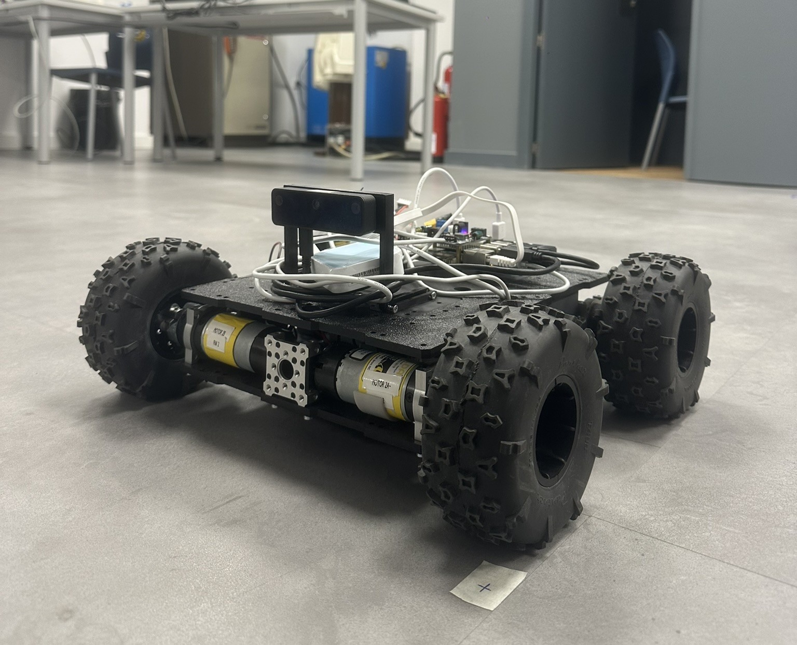
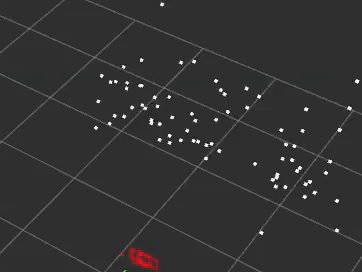
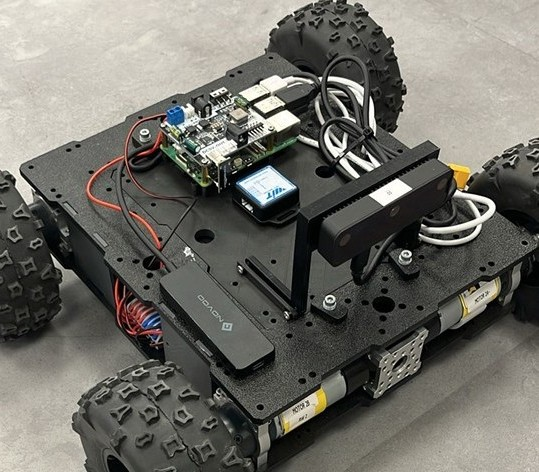

# Visual-Inertial Navigation System for Raspberry Pi 5 (UPM Platform)

**Author:** Jakub Sznyter  
**Institution:** Universidad Politécnica de Madrid (UPM) - ETSIDI  
**Thesis:** *Implementation of a VSLAM Algorithm on a Mobile Robot Using a Raspberry Pi 5*  
**Date:** January 2026


[](./Sznyter_Bachelor_Thesis_2026.pdf)
<br />

<div align="left">
  
  
</div>

---

## 📖 Project Overview

This repository contains the complete software stack for an Unmanned Ground Vehicle (UGV) designed for GNSS-denied indoor environments. The project was developed as part of a Bachelor Thesis in Mechatronics Engineering at the Escuela Técnica Superior de Ingeniería y Diseño Industrial (ETSIDI) of the Universidad Politécnica de Madrid (UPM), within the Department of Electrical Engineering, Electronics, Automation and Applied Physics.

The system implements a tightly-coupled **Visual-Inertial SLAM (VINS-Fusion)** on a low-cost, resource-constrained embedded platform. It addresses specific engineering challenges of the **ARM64 architecture** (Raspberry Pi 5) running **Ubuntu 24.04**, utilising a hybrid architecture where hardware drivers run natively, while the state estimator runs in an isolated, optimized container.

### Key Features
* **Hybrid Architecture:** Solves dependency conflicts (Eigen 3.3.9/Ceres 2.1.0) between the modern Host OS (Ubuntu 24.04) and legacy SLAM algorithms via Docker containerization.
* **Real-Time Performance:** Optimized for RPi 5 (quad-core ARM Cortex-A76), achieving stable 15Hz stereo tracking and 200Hz IMU pre-integration. *(See [Performance & Validation](#-performance--validation) for detailed error metrics and thermal analysis).*
* **Automated Hardware Abstraction Layer (HAL):** Modular ROS 2 drivers for RoboClaw motor drivers, OAK-D Lite (Stereo Camera) and WitMotion IMU orchestrated via Linux services, which enforce a strict boot sequence ensuring drivers initialization on platform startup.
* **Dynamic Self-Calibration:** Leverages built-in estimator features by configuring online extrinsic parameter estimation. This allows the system to autonomously refine the spatial transformation matrix between the camera and IMU in real-time, compensating for manual measurement inaccuracies and mechanical vibrations.

### Technical Challenges
* **ARM64 Dependency Resolution:** Implementing the software stack on the Raspberry Pi 5 required overcoming significant compatibility barriers, as the device requires Ubuntu 24.04 for full native driver support. However, many essential robotic binaries are only pre-compiled for x86 architectures, necessitating source compilation for ARM64.  
* **Legacy Library Isolation:** The VINS-Fusion algorithm relies on specific legacy versions of mathematical libraries, notably Ceres Solver and Eigen. Modern versions of these libraries included in Ubuntu 24.04 lack backward compatibility, which prevents the algorithm from executing natively on the host system.  
* **Docker-Based Environment Management:** To solve this conflict, the state estimator was deployed within a Docker container running a compatible, older Linux distribution. This strategy allows the modern host OS to manage hardware while the container provides a stable "sandbox" for the legacy SLAM dependencies.  
* **Network Latency Optimization:** To maintain real-time performance, the container was configured with the Host Network driver. This bypasses the standard Docker NAT bridge, eliminating communication delays between the host-based sensor drivers and the containerized estimator.  

---

## 🔧 Hardware Specifications

&nbsp;&nbsp;&nbsp;&nbsp;The algorithm was validated on a custom research platform with the following specs:

<p align="left">
  &nbsp;&nbsp;&nbsp;&nbsp;
  
</p>

* **Compute Unit:** Raspberry Pi 5 (8GB RAM) running Ubuntu 24.04 LTS.
* **Vision Sensor:** Luxonis **OAK-D Lite** (Passive Stereo, 640x480).
* **Inertial Unit:** WitMotion **WT901C** (9-DoF, USB-UART, 200Hz).
* **Chassis:** goBILDA Recon (Differential Drive/Skid-Steer).
* **Motor Controller:** RoboClaw 2x7A (Packet Serial Mode).
* **Power:** 4S LiPo Battery (14.8V, 3700mAh).

---

## ⚙️ System Architecture


The software is organized into three logical layers communicating via the ROS 2 (DDS) middleware:

| Layer | Component | Description | Context |
| :--- | :--- | :--- | :--- |
| **Hardware** | `robot_driver` | Differential drive kinematics, odometry calculation, and serial communication with **RoboClaw**. | **Host (Ubuntu 24.04)** |
| | `depthai_ros` | Driver for **OAK-D Lite** configured for 480p Stereo Vision @ 15Hz. | **Host** |
| | `witmotion_ros` | Driver for **WT901C** IMU providing 200Hz inertial data. | **Host** |
| **Estimation** | `vins_node` | **VINS-Fusion** state estimator optimized for ARM64 with sliding window optimization. | **Docker (Ubuntu 22.04)** |
| **Visualization**| `rviz2` | Real-time trajectory and sparse point cloud rendering. | **Remote / Host** |

> **Note on Networking:** The Docker container utilizes `--net host` to bypass the NAT bridge, eliminating latency in the DDS communication layer which is critical for visual-inertial synchronization.

### 🛠️ Development & Validation Tools
* **Containerization:** Docker (with `--privileged` and `--net host` access).
* **Data Logging:** `ros2 bag` (MCAP format) for offline dataset playback.
* **Trajectory Analysis:** **[evo](https://github.com/MichaelGrupp/evo)** package for APE/RPE error metrics and plot generation.

---

## 📡 ROS 2 Interfaces (Topics)

The system utilizes a Publisher-Subscriber model for asynchronous data exchange between the hardware layer (Host) and the estimation layer (Docker).

| Topic Name | Message Type | Description | Frequency |
| :--- | :--- | :--- | :--- |
| **Inputs (Hardware → VINS)** | | | |
| `/oak/left/image_raw` | `sensor_msgs/Image` | Raw monochromatic image from the left camera lens. Used for feature tracking. | 15 Hz |
| `/oak/right/image_raw` | `sensor_msgs/Image` | Raw monochromatic image from the right camera lens. Used for depth estimation. | 15 Hz |
| `/imu/data` | `sensor_msgs/Imu` | High-frequency inertial data (Accel + Gyro) from WitMotion sensor. | 200 Hz |
| **State Estimation** | | | |
`/odom` | `nav_msgs/Odometry` | **Wheel Odometry (Baseline)** Computed locally on the Host by the custom driver (part of the **robot_driver** package) using differential drive kinematics and encoder ticks. | ~20 Hz | *
| `/vins_estimator/odometry` | `nav_msgs/Odometry` | Real-time estimation of the robot's Global Pose (Position + Orientation) and Velocity. | ~15 Hz |
| `/vins_estimator/path` | `nav_msgs/Path` | History of the estimated trajectory (visualized as a green line in RViz). | 10 Hz |
| `/vins_estimator/point_cloud` | `sensor_msgs/PointCloud2`| Sparse point cloud representing currently tracked visual features (landmarks). | 15 Hz |
| **Control** | | | |
| `/cmd_vel` | `geometry_msgs/Twist` | Linear and angular velocity commands sent to the motors' drivers. | Variable |

---

## 🚀 Installation & Build

### 1. Prerequisites (Host Machine)
* **Operating System:** Ubuntu 24.04 LTS.
* **Middleware:** ROS 2 Jazzy Jalisco.
* **Python Dependencies:** `pyserial`, `roboclaw`.

### 2. Setting up the Hardware Layer (Host)

Clone the repository and install native dependencies:

```
# Clone the repo
git clone https://github.com/jakubsznyter/upm_etsidi_visual_nav.git robot_ws
cd robot_ws/hardware_host

# Install driver dependencies
sudo apt install ros-jazzy-depthai-ros ros-jazzy-serial-driver
pip3 install pyserial roboclaw

# Install ROS dependencies
rosdep install --from-paths src --ignore-src -r -y

# Build the hardware abstraction layer
colcon build --symlink-install
source install/setup.bash

```

### 3. Setting up the Estimator (Docker)
To bypass compatibility issues with Eigen 3.3.9 and Ceres 2.1.0 on Ubuntu 24.04, the VINS-Fusion node is containerized running ROS 2 Humble.

```
# Build the Docker image (ARM64 optimized)
cd vins_docker/VINS-Fusion-ROS2-humble-arm
docker build -t vins_humble -f docker/Dockerfile .
```
The system is designed to launch in two stages: the hardware drivers (host) and the algorithmic core (container).

Step 1: Launch Hardware Drivers  
This command starts the camera, IMU, and motor controllers via the orchestrated launch file.

```
ros2 launch /home/robot_ws/hardware_host/launch/robot_app.launch.py
```
Step 2: Launch VINS-Fusion Container  
**First-time initialization:**
Run the provided script to start the container. This script handles X11 forwarding (for GUI support) and host networking.  
```
./docker/run.sh
```

Once inside the container shell, build and source:

```
cd vins
colcon build --symlink-install --cmake-args -DCMAKE_BUILD_TYPE=Release --parallel-workers 2
source install/setup.bash
cd /src/VINS-Fusion-ROS2-humble-arm/vins/config
ros2 run vins vins_node $(pwd)upm_robot_config.yaml
```
**Subsequent launches:**  
Once the container has been created, you don't need to run the full script again. You can simply start the existing container and attach to it:
```
# Start the container
docker start -ai vins_container

# Open a new terminal session inside the running container
docker exec -it vins_container bash
```
**Option B: Pull Pre-built Image**  
If building the image locally takes too long or fails, you can pull the pre-compiled version from Docker Hub:
```
# Pull the image
docker pull jakubsznyter/vins_humble:latest

# Retag it to match the launch script expectation
docker tag jakubsznyter/vins_humble:latest vins_humble  

./docker/run.sh
```
---

## 🤖 System Automation (Service Orchestration)

To enable automatic startup the robot's boot sequence is managed by a **systemd** service hierarchy. This architecture enforces a strict dependency chain, ensuring that the hardware environment is fully initialized before the state estimator starts.

### 1. Service Configuration (`robot.service`)
The orchestration is handled by a master service file that acts as a process supervisor. It is designed to be universal, requiring only a simple user-specific adjustment.

* **Location in Repo:** `hardware_host/services/robot.service`
* **Trigger:** Starts automatically once `network-online.target` is reached to ensure the ROS 2 DDS middleware has a valid network stack.
* **User Isolation:** Runs under a specific system user (e.g., `vins-slam`) to manage hardware permissions.
* **Recovery:** Configured with `Restart=always` and a 10-second delay to automatically recover the stack in case of a software crash.

### 2. The Entry-Point Script (`start_robot.sh`)
The service delegates the execution logic to a specialized shell script. This "wrapper" strategy ensures the complex ROS 2 environment is sourced correctly.

* **Location in Repo:** `hardware_host/scripts/start_robot.sh`
* **Environment Loading:** Sourced from both the global ROS 2 Jazzy installation and the local `hardware_host` workspace.
* **Network Identification:** Explicitly exports `ROS_DOMAIN_ID=0` to define the robot's communication group.
* **Signal Handling:** Uses the `exec` command to replace the shell process with the ROS 2 launch system.

### 3. Deployment Instructions

To enable the automation on the Raspberry Pi 5:

**Step 1: Configure the User**
Open `hardware_host/services/robot.service` and ensure the `User=` field matches your system username:
```ini
[Service]
User=vins-slam  # Change this to your actual username
```
Step 2: Install and Enable
Run the following commands to register the service:

```
# 1. Copy the service file to the system directory
sudo cp hardware_host/services/robot.service /etc/systemd/system/

# 2. Make the startup script executable
chmod +x hardware_host/scripts/start_robot.sh

# 3. Enable and start the service
sudo systemctl daemon-reload
sudo systemctl enable robot.service
sudo systemctl start robot.service
```
You can monitor the live boot logs by running:
```
journalctl -u robot.service -f
```

---

## 🖥️ Remote Management & Visualization

To optimize the computational resources of the Raspberry Pi 5, the system follows a distributed processing workflow. High-level system management is handled via VNC, while the resource-intensive graphical rendering of **RViz2** is offloaded to a **Remote Workstation**.

### 1. Network Configuration
For seamless communication via ROS 2 DDS, both the Robot and the Workstation must reside on the same local area network.

| Parameter | Value |
| :--- | :--- |
| **Network SSID** | `UPM_Robot_AP` (Onboard TP-Link Access Point) |
| **Robot IP** | `192.168.0.100` (Static) |
| **Workstation IP** | `192.168.0.x` (Assigned via DHCP) |

> **Technical Note:** Because the Docker container uses the `--net=host` configuration, it shares the robot's network stack directly. This allows the Remote Workstation to discover VINS topics automatically without requiring complex port forwarding or network bridges.

### 2. System Management (VNC)
The VNC interface serves as the primary gateway for terminal management and teleoperation.

* **Connection:** Access the robot at `192.168.0.100:5900` using a VNC viewer.
* **Orchestration:** Use the VNC terminal to launch the hardware abstraction layer and the SLAM container.
* **Teleoperation:** While monitoring the SLAM output on your workstation, you can utilize the VNC terminal to command the robot's movement:
    ```bash
    ros2 run teleop_twist_keyboard teleop_twist_keyboard
    ```

### 3. Remote Visualization (RViz2 on Workstation)
By running RViz2 on an external Workstation, you prevent CPU thermal throttling on the Raspberry Pi 5, ensuring the VINS-Fusion algorithm maintains real-time performance.


**Steps to visualize from the Remote Workstation:**
1.  Open a terminal on your **Workstation**.
2.  Ensure the project repository is available locally to access the configuration files.
3.  Launch RViz2 using the project's optimized configuration by pointing to the specific file path:
    ```
    # Execute from the workstation terminal
    ros2 run rviz2 rviz2 \
    -d robot_ws/vins_docker/vins/src/VINS-Fusion-ROS2-humble-arm/vins/config/vins_rviz_config.rviz
    ```

### 4. Monitored Data Streams
The following streams are visualized on the workstation to validate the estimator's health:
* **Pose Estimation:** `/vins_estimator/odometry` (VINS output) vs. `/odom` (Wheel Odometry baseline).
* **Landmark Map:** `/vins_estimator/point_cloud` (Visual features used for sliding window optimization).
* **Estimated Trajectory (Path):** `/vins_estimator/path` - This stream provides a continuous visual history of the robot's motion. It is essential for verifying the consistency of the SLAM solution over time and identifying potential drift during long-duration maneuvers.

> **⚠️ Connectivity Checklist:**
> For these topics to appear in RViz2, ensure that:
> 1.  **Network:** The Workstation is connected directly to the robot's Wi-Fi (`UPM_Robot_AP`).
> 2.  **ROS Domain:** Both the Robot (Docker) and the Workstation are configured with the same `ROS_DOMAIN_ID` (Default is usually `0`).

---

## 📊 Performance & Validation

The system underwent testing in a laboratory environment. The performance was quantified using the **EVO** evaluation package, utilizing calibrated wheel odometry as the reference baseline.

### 1. Accuracy & Stability ("L-Maneuver" Test)
To verify rotational precision—critical for VINS—the robot performed repeated 90° turns.
* **Median Rotation Error:** `~0.2°` (after IMU bias convergence) [Chapter 6.2].
* **Translation Error:** `~0.03m` Mean Error relative to wheel odometry (validated physically with <1% deviation over 4m trajectory).
* **Drift Characteristics:** The system demonstrated self-correction capabilities, effectively estimating gyroscope bias online to eliminate drift during straight-line segments.

### 2. Computational Efficiency (Raspberry Pi 5)
A key objective was achieving real-time performance on ARM64 architecture.
* **CPU Load:** `~69.3%` average usage (4-core Cortex-A76).
* **RAM Usage:** `~1.4 GB` (17.9%) - highly efficient due to the sliding-window marginalization strategy.
* **Thermal Constraints:** During intensive optimization (VINS loop closure), SoC temperatures reached **85°C**, indicating the necessity for active cooling in production deployments.

### 3. Engineering Challenges: Visual-Inertial Degeneracy
During limit testing on **smooth, textureless concrete**, the system experienced Z-axis drift.
* **Root Cause:** The OAK-D Lite uses **Passive Stereo**. On textureless floors, the lack of high-contrast features caused the optical flow tracker to fail.
* **Physical Consequence:** Without visual lock, the estimator could not decouple gravity from centrifugal force during turns, erroneously interpreting lateral acceleration as a "roll" angle.
* **Solution Identified:** For industrial deployment on uniform surfaces, an **Active Stereo** camera (with IR dot projector) is required to artificially texture the scene.  

---

## 🤝 Acknowledgements & Credits

This project builds upon the open-source work of the robotics community. Special thanks to:

### Algorithmic Core: VINS-Fusion 
* **Source:** [HKUST-Aerial-Robotics](https://github.com/HKUST-Aerial-Robotics/VINS-Fusion) 
* **Authors:** Qin Tong, Peiliang Li, Shaojie Shen
* **My Contribution:**
    * **ROS 2 Migration:** Ported the original ROS 1 logic to **ROS 2 Humble**.
    * **ARM64 Porting:** Recompiled legacy dependencies (Ceres, Eigen) to run natively on the **Raspberry Pi 5** architecture.
    * **Dockerization:** Encapsulated the estimator in an isolated container to resolve library conflicts with Ubuntu 24.04.

### Hardware Drivers & Platform:
* **Original Author:** [lucastillo3420/Robot](https://github.com/lucastillo3420/Robot) (VSLAM con robot diferencial y cámara RGB-D).
* **Author:** Lucas Castillo (UPM ETSIDI).
* **Context:** A former UPM student who developed the initial hardware abstraction layer (HAL) for this specific mobile chassis. His work served as the starting point for the motor control logic.
* **My Contributions (System Overhaul):**
    * **From RGB-D to VINS:** Replaced the previous RGB-D mapping approach with a tightly-coupled **Stereo-Visual-Inertial** architecture, enabling high-speed tracking in dynamic environments.
    * **Autonomous Boot Sequence:** Replaced manual startup scripts with a robust **systemd** orchestration layer, allowing for headless operation immediately after power-on.
    * **Network Architecture:** Implemented a distributed computing model (Host/Docker/Remote PC) via DDS, replacing the previous local-only visualization workflow.
    * **Trajectory Execution Logic:** Implemented precise path following for pre-planned trajectories rather than simple teleoperation.

### Validation & Analysis Tools
* **[evo Package](https://github.com/MichaelGrupp/evo)** by **Michael Grupp**: Essential for trajectory evaluation, error metrics (APE/RPE), and generating the validation plots.

---
## 📚 Reference & License
This project is licensed under the **GNU GPL v3.0**.

Developed by Jakub Sznyter as part of a Bachelor Thesis at UPM ETSIDI (2026):
> **"Implementation of a VSLAM Algorithm on a Mobile Robot Using a Raspberry Pi 5" (2026)**  

📄 **[Download Full Thesis (PDF)](./Sznyter_TFG_Thesis_2026.pdf)**

If you use this code for your research, please cite:

```bibtex
@thesis{sznyter2026vslam,
  author = {Jakub Sznyter},
  title = {Implementation of a VSLAM Algorithm on a Mobile Robot Using a Raspberry Pi 5},
  school = {Universidad Politécnica de Madrid (UPM)},
  year = {2026}
}
